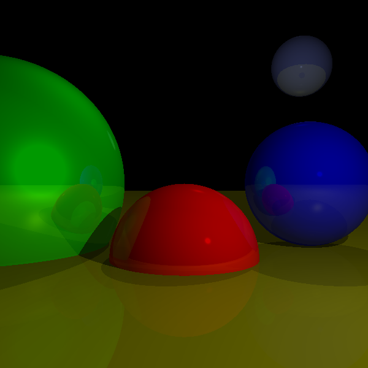

# Computer-Graphics-From-Scratch
Simple ray-tracer made to learn the basics of computer graphics.

Based on the excellent online textook "Computer Graphics from scratch" by Gabriel Gambetta.

## Exemplary rendering scene
```bash
sphere_t spheres[SPHERES] = {sphere_t{coords_t{0, -1, 3}, 1, rgb_t{255, 0, 0}, 500, 0.2},
                             sphere_t{coords_t{2, 0, 4}, 1, rgb_t{0, 0, 255}, 500, 0.3},
                             sphere_t{coords_t{-3, 0, 4}, 2, rgb_t{0, 255, 0}, 10, 0.4},
                             sphere_t{coords_t{0, -5001, 0}, 5000, rgb_t{70, 70, 70}, 50, 0.1},
                             sphere_t{coords_t{80, 80, 250}, 20, rgb_t{80, 89, 150}, 700, 0.4}};
```

